<h1>Chapter 1</h1>

<h2>Memory</h2>

**bit:**  basic unit memory is called a bit, 0 or 1

**byte:** the smallest unit on which the hardware operates, 8 consecutive bits

**word:** the number of bytes and the order of bytes in a word vary from machine to 		machine

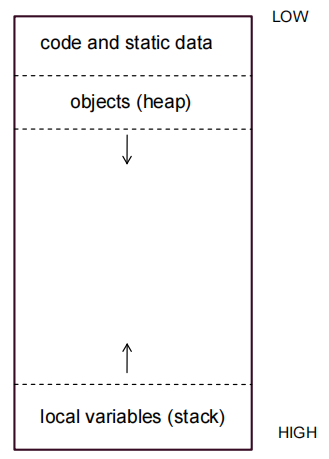

**static data:** never created or destroyed as program runs, such as named constants

**heap:** When a new object is created, Java allocates space from heap

**reference:** Java identifies an object by its address in memory. That address is called a reference.

**garbage:** created in the intermediate step but not referenced by the final stack

> When memory is running short, Java does garbage collection
>
> + Mark the objects referenced by variables on stack or in static storage. 
>
> + Sweep all objects in the heap, reclaim unmarked objects (garbage). 


<u>In java, primitive types and objects are passed differently as arguments</u>

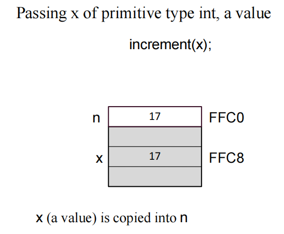

When you pass an argument of a **primitive type** to a method, Java copies the **value** of the argument into the parameter variable. As a result, changes to the parameter variable have **no effect** on the argument.

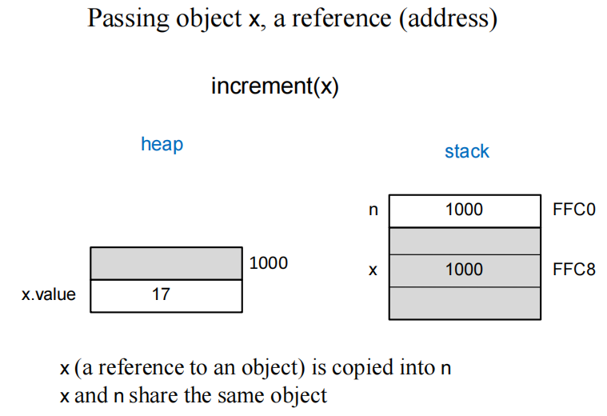

When you pass an **object** as an argument, java copies the **reference** of the argument into that parameter variable. Thus, any changes that you make to the instance variables *inside* an object have a permanent effect on the object.


<h1>Chapter 2</h1>

<h2>Arrays</h2>

+ An ordered collection of values
+ fixed length
+ Homogeneous: Each value in the array is of the same type

**elements:** The individual values in an array

**length:** The number of elements

**index:** Each element is identified by its position in the array; begins with 0

```java
type[ ] identifier = new type[length];
```


**Applications**

1. <u>Passing arrays as parameters</u> (primitive types vs objects)

   ```
   swapElements(array[i], array[n – i – 1]) // wrong
       
   swapElements(array, i, n – i – 1)
   ```

2. Two-dimensional array

   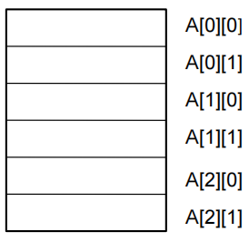

3. 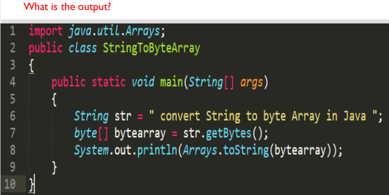

   An array containing ASCII codes for each character in the string.


<h1>Chapter 3</h1>

<h2>List (Linked List)</h2>

**Linked list:** collection of nodes in which one node is connected to another node

+ a linear data structure
+ support different data types in a linked list

+ linked list elements are not stored at a contiguous location; they are linked using pointers

>  Advantages

1. Dynamic data structure: 

   The size of a linked list is not fixed as it can vary according to requirements. 

2. Insertion and Deletion: 

   If we want to insert or delete the element in an array, then we need to shift the elements for creating the space. In a linked list, we do not have to shift the elements. We just need to update the address of the pointer in the node. 

3. Memory efficient:

   Its memory consumption is efficient as the size of the linked list can grow

   or shrink according to our requirements.

> Disadvantages

1. Memory usage

   The node in a linked list occupies more memory than array as each node occupies two types of variables, 

2. Traversal

   In an array, we can randomly access the element by index. In a linked list, the traversal is not easy. If we want to access the element in a linked list, we cannot access the element randomly. 

3. Reverse traversing

   In a linked list, backtracking or reverse traversing is difficult. 

   In a doubly linked list, it is easier but requires more memory to store the back pointer.


**Applications**

1. Polynomial

   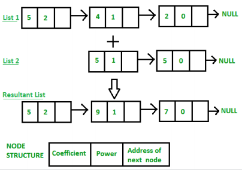

2. Sparse Matrix

   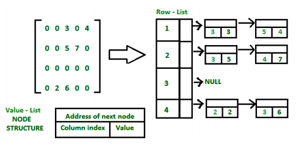


**Different types of linked list**

1. Singly Linked List
2. Doubly Linked List
3. Circular Linked List
4. Doubly Circular Linked List


> Cautions

1. 在操作linked list的nodes时，需要注意操作顺序

   我们在进行任何操作时都只有一个可供参考的指针（无论是head，还是自行建立的current），因此在添加new node时，<u>如果添加处后面还有其他元素，必须先将new node的next指针接上后续list，再将我们的参考指针指向new node</u>

2. 每次进行iteration都一定要记得判断next指针的对象是否为null

**Implementation**

> use two pointers
>
> + different start point
> + different speed

1. different start point

   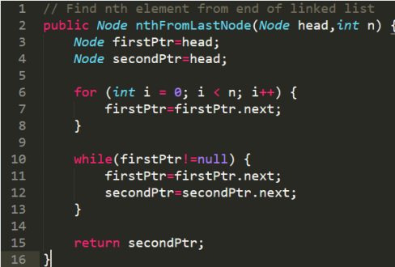

2.  different speed

   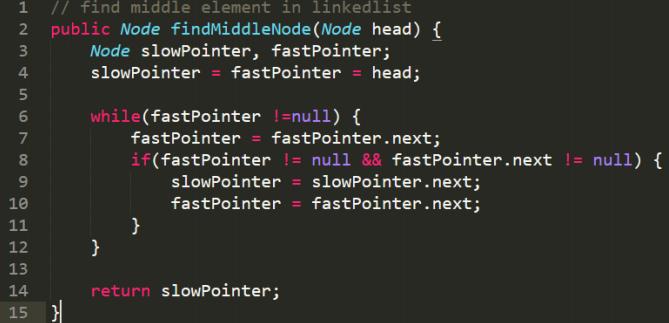

3. two ways to reverse a linked list from a certain node

   

   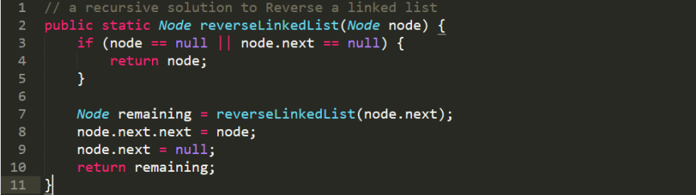


<h1>Chapter 4</h1>

<h2>Stack</h2>

+ A Stack is an abstract data type with a pre-defined capacity
+ **LIFO** (Last In, First Out)
+ Stack has one end. It contains only one pointer top pointer pointing to the topmost element of the stack.

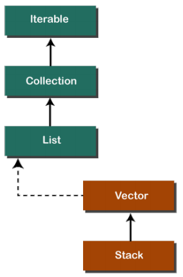

**Implementations & Operations**

1. push:

   check if the stack is full, top = top + 1

   若用linked list记得先令 `newNode.next = top`

2. pop:

   check if the stack is empty, top = top - 1

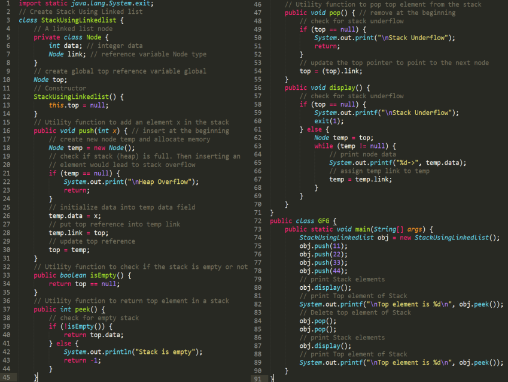


<h2>Queue</h2>

+ insert operations to be performed at one end called **REAR**
+ delete operations to be performed at another end called **FRONT**
+ Queue is referred to be as First In First Out list (**FIFO**)

**Operations**

1. Enqueue: Insert the element at the rear end of the queue. It returns void. 

   > + Check if the queue is already full by comparing rear to max - 1
   >
   > + If the item is to be inserted as the first element in the list, in that case set the value of front and rear to 0 and insert the element at the rear end. 

   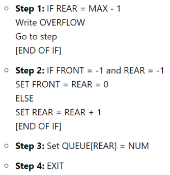

2. Dequeue: Delete from the front-end of the queue. It returns the element which has been removed from the front-end. 

   > If, the value of front is -1 or value of front is greater than rear , write an underflow message and exit.

   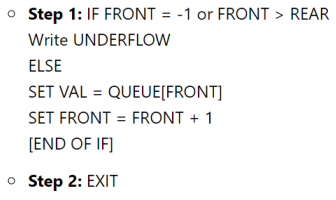

3. Peek: Return the element, which is pointed by the front pointer in the queue but does not delete it. 

4. Queue overflow (isfull):When the queue is completely full,thenit shows the overflow condition. 

5. Queue underflow (isempty): When the queue is empty, it throws the underflow condition.


An insertion takes place from the rear while the deletion occurs from the front

> + Drawback: insertion is done only from the rear end (**front之前的内存空间被浪费**)
>
> If the first three elements are deleted from the queue, we cannot insert more elements even though the space is available in a linear queue. The linear queue shows the overflow condition as the rear is pointing to the last element of the queue.


<h3>Circular Queue</h3>

+ the last element of the queue is connected to the first element

+ Drawback that occurs in a linear queue is overcome. 

  If the empty space is available in a circular queue, the new element can be added in an empty space by simply incrementing the value of rear

**Operations**

1. Enqueue:

   First, check whether the queue is full or not. 

   Initially set both front and rear to -1. To insert the first element, both front and rear are set to 0. 

   To insert a new element, the rear gets incremented.

   

2. Dequeue:

   First, check whether the queue is empty or not. If the queue is empty, we cannot perform the dequeue operation. 

   When the element is deleted, the value of front gets decremented by 1. 

   If there is only one element left which is to be deleted, then the front and rear are reset to -1.


<h3>Priority Queue</h3>

+ The priority of the elements in a priority queue will determine the order in which elements are removed from the priority queue.

  The element with the highest priority would come first in a priority queue.

  If two elements in a priority queue have the same priority, they will be arranged using the FIFO principle.

+ The elements are either arranged in an ascending or descending order

**Operations**

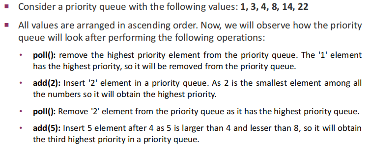

**Implementation**

> There are 4 ways to implement priority queue:
>
> 1. array
> 2. linked list
> 3. heap data structure
> 4. binary search tree
>
> <u>The heap data structure is the most efficient way</u>


<h3>Double Ended Queue</h3>

+ Does not follow the FIFO principle

+ Insertion and deletion can occur from both ends

  + Input-restricted

    

  + Output-restricted

    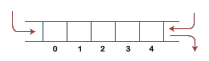

+ Can be used both as stack and queue

**Operations**

1. enqueue_front(): It is used to insert the element from the front end. 

2. enqueue_rear(): It is used to insert the element from the rear end. 

3. dequeue_front(): It is used to delete the element from the front end. 

4. dequeue_rear(): It is used to delete the element from the rear end. 
5. getfront(): It is used to return the front element of the deque. 
6. getrear(): It is used to return the rear element of the deque


**Queue - Applications**

+ Implement stack with queue

  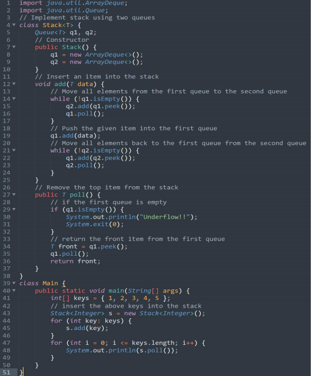

