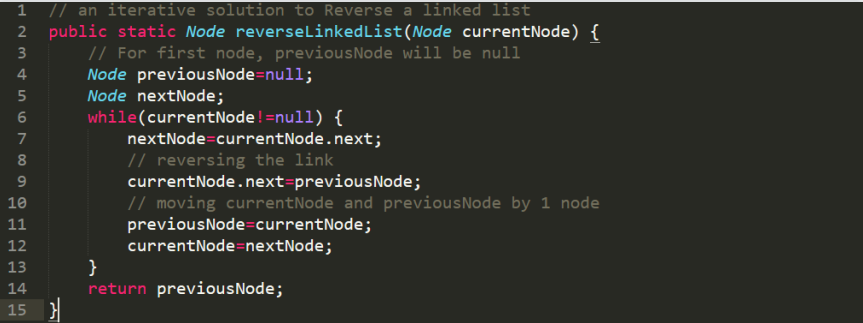
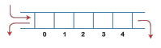

<h1>Chapter 1</h1>

<h2>Memory</h2>

**bit:**  basic unit memory is called a bit, 0 or 1

**byte:** the smallest unit on which the hardware operates, 8 consecutive bits

**word:** the number of bytes and the order of bytes in a word vary from machine to machine


**static data:** never created or destroyed as program runs, such as named constants

**heap:** When a new object is created, Java allocates space from heap

**reference:** Java identifies an object by its address in memory. That address is called a reference.

**garbage:** created in the intermediate step but not referenced by the final stack

> When memory is running short, Java does garbage collection
>
> + Mark the objects referenced by variables on stack or in static storage. 
>
> + Sweep all objects in the heap, reclaim unmarked objects (garbage). 


<u>In java, primitive types and objects are passed differently as arguments</u>


When you pass an argument of a **primitive type** to a method, Java copies the **value** of the argument into the parameter variable. As a result, changes to the parameter variable have **no effect** on the orignial argument.


When you pass an **object** as an argument, java copies the **reference** of the argument into that parameter variable. Thus, any changes that you make to the instance variables *inside* an object have a permanent effect on the object.


<h1>Chapter 2</h1>

<h2>Arrays</h2>

+ An ordered collection of values
+ fixed length
+ Homogeneous: Each value in the array is of the same type

**elements:** The individual values in an array

**length:** The number of elements

**index:** Each element is identified by its position in the array; begins with 0

```java
type[ ] identifier = new type[length];
```


**Applications**

1. <u>Passing arrays as parameters</u> (primitive types vs objects)

   ```
   swapElements(array[i], array[n – i – 1]) // wrong
       
   swapElements(array, i, n – i – 1)
   ```

2. Two-dimensional array

   

3. 

   An array containing ASCII codes for each character in the string.


<h1>Chapter 3</h1>

<h2>List (Linked List)</h2>

**Linked list:** collection of nodes in which one node is connected to another node

+ a linear data structure
+ support different data types in a linked list

+ linked list elements are not stored at a contiguous location; they are linked using pointers

>  Advantages

1. Dynamic data structure: 

   The size of a linked list is not fixed as it can vary according to requirements. 

2. Insertion and Deletion: 

   If we want to insert or delete the element in an array, then we need to shift the elements for creating the space. In a linked list, we do not have to shift the elements. We just need to update the address of the pointer in the node. 

3. Memory efficient:

   Its memory consumption is efficient as the size of the linked list can grow or shrink according to our requirements.


> Disadvantages

1. Memory usage

   The node in a linked list occupies more memory than array as each node occupies two types of variables, 

2. Traversal

   In an array, we can randomly access the element by index. In a linked list, the traversal is not easy. If we want to access the element in a linked list, we cannot access the element randomly. 

3. Reverse traversing

   In a linked list, backtracking or reverse traversing is difficult. 

   In a doubly linked list, it is easier but requires more memory to store the back pointer.


**Applications**

1. Polynomial

   

2. Sparse Matrix

   


**Different types of linked list**

1. Singly Linked List
2. Doubly Linked List
3. Circular Linked List
4. Doubly Circular Linked List


> Cautions

1. 在操作linked list的nodes时，需要注意操作顺序

   我们在进行任何操作时都只有一个可供参考的指针（无论是head，还是自行建立的current），因此在添加new node时，<u>如果添加处后面还有其他元素，必须先将new node的next指针接上后续list，再将我们的参考指针指向new node</u>

2. 每次进行iteration都一定要记得判断next指针的对象是否为null

**Implementation**

> use two pointers
>
> + different start point
> + different speed

1. different start point

   

2.  different speed

   

3. two ways to reverse a linked list from a certain node

   

   


<h1>Chapter 4</h1>

<h2>Stack</h2>

+ A Stack is an abstract data type with a pre-defined capacity
+ **LIFO** (Last In, First Out)
+ Stack has one end. It contains only one pointer top pointer pointing to the topmost element of the stack.


**Implementations & Operations**

1. push:

   check whether the stack is full, top = top + 1

   若用linked list记得先令 `newNode.next = top`

2. pop:

   check if the stack is empty, top = top - 1


<h2>Queue</h2>

+ insert operations to be performed at one end called **REAR**
+ delete operations to be performed at another end called **FRONT**
+ Queue is referred to be as First In First Out list (**FIFO**)

**Operations**

1. Enqueue: Insert the element at the rear end of the queue. It returns void. 

   > + Check if the queue is already full by comparing rear to max - 1
   >
   > + If the item is to be inserted as the first element in the list, in that case set the value of front and rear to 0 and insert the element at the rear end. 

   

2. Dequeue: Delete from the front-end of the queue. It returns the element which has been removed from the front-end. 

   > If, the value of front is -1 or value of front is greater than rear , write an underflow message and exit.

   

3. Peek: Return the element, which is pointed by the front pointer in the queue but does not delete it. 

4. Queue overflow (isfull):When the queue is completely full, it shows the overflow condition. 

5. Queue underflow (isempty): When the queue is empty, it throws the underflow condition.


An insertion takes place from the rear while the deletion occurs from the front

> + Drawback: insertion is done only from the rear end (**front之前的内存空间被浪费**)
>
> If the first three elements are deleted from the queue, we cannot insert more elements even though the space is available in a linear queue. The linear queue shows the overflow condition as the rear is pointing to the last element of the queue.


<h3>Circular Queue</h3>

+ the last element of the queue is connected to the first element

+ Drawback that occurs in a linear queue is overcome. 

  If the empty space is available in a circular queue, the new element can be added in an empty space by simply incrementing the value of rear

**Operations**

1. Enqueue:

   First, check whether the queue is full or not. 

   Initially set both front and rear to -1. To insert the first element, both front and rear are set to 0. 

   To insert a new element, the rear gets incremented.

   

2. Dequeue:

   First, check whether the queue is empty or not. If the queue is empty, we cannot perform the dequeue operation. 

   When the element is deleted, the value of front gets decremented by 1. 

   If there is only one element left which is to be deleted, then the front and rear are reset to -1.


<h3>Priority Queue</h3>

+ The priority of the elements in a priority queue will determine the order in which elements are removed from the priority queue.

  The element with the highest priority would come first in a priority queue.

  If two elements in a priority queue have the same priority, they will be arranged using the FIFO principle.

+ The elements are either arranged in an ascending or descending order

**Operations**


**Implementation**

> There are 4 ways to implement priority queue:
>
> 1. array
> 2. linked list
> 3. heap data structure
> 4. binary search tree
>
> <u>The heap data structure is the most efficient way</u>


<h3>Double Ended Queue</h3>

+ Does not follow the FIFO principle

+ Insertion and deletion can occur from both ends

  + Input-restricted

    

  + Output-restricted

    

+ Can be used both as stack and queue

**Operations**

1. enqueue_front(): It is used to insert the element from the front end. 

2. enqueue_rear(): It is used to insert the element from the rear end. 

3. dequeue_front(): It is used to delete the element from the front end. 

4. dequeue_rear(): It is used to delete the element from the rear end. 
5. getfront(): It is used to return the front element of the deque. 
6. getrear(): It is used to return the rear element of the deque


**Queue - Applications**

+ Implement stack with queue

  


<h1>Final Exam</h1>

> 20-30% for first half; 70-80% for second half.
>
> chapter 1. introduction.
> no special questions on java.
>
> chapter 2. memory and array
> stack memory and heap memory basic knowledge.
> address model for array.
> reference/pointer concept.
> one-dimensionary array, two-dimensionary array, sparse array.
> index of arrays.
>
> chapter 3. linked list
> array vs linked list: advantages and disadvantages.
> sparse array as linked list.
> singly lisked list, doubly linked list, circular linked list.
> operations.
>
> chapter 4. stack and queue
> stack vs queue: characteristics and differences.
> operations.
> linear queue, circular queue, priority queue.
>
> chapter 5. tree
> nonlinear vs linear data structures.
> tree concepts: root, children, parent, sibling, internal, leaves, ancestor, descendants.
> binary tree and implementation: full/complete/perfect/balanced.
> binary search tree: create bst, traversal (inorder, preorder, postorder).
> huffman tree
>
> chapter 6. graph
> concept: G=(V,E).
> undirected vs directed.
> complete, weighted graphs.
> representation: adjacency matrix, adjacency list.
> traversal: breath-first search, depth-first search.
> minimum spanning tree: Kruskal's algorithm, Prim's algorithm.
> topological sorting.
>
> chapter 7. not for exam.
>
> chapter 8. sorting
> simple sorting: bubble sort, selection sort, insertion sort.
> advanced sorting: merge sort, quick sort.
> complexity.
>
> others: complexity concepts


<h1>Complexity</h1>

**Algorithm:** An algorithm is a finite set of instructions that performs a certain computation or solve a problem

In general, we are not so much interested in the time and space complexity for small inputs. What is important is the growth of the complexity functions.

**Growth Function:**

> **Definition:** Let *f* and *g* be functions from the integers or the real numbers to the real
>
> ​					 numbers. We say that *f(x)* is *O(g(x))* if there are constants *C* and *k* such that
>
> ​												***|f(x)|* *≤* *C|g(x)|,* whenever *x > k*.**


**tractable:** A problem that can be solved with polynomial worst-case complexity

**unsolvable:** Problems that no algorithm can solve

> Computations
>
> If *f**1**(x)* is *O(g**1**(x))* and *f**2**(x)* is *O(g**2**(x))*, then *(f**1** + f**2**)(x)* is *O(max(g**1**(x), g**2**(x))).*
>
> If *f**1**(x)* is *O(g(x))* and *f**2**(x)* is *O(g(x))*, then *(f**1*** *+ f**2**)(x) is O(g(x))*.
>
> If *f**1**(x)* is *O(g**1**(x))* and *f**2**(x)* is *O(g**2**(x))*, then *(f**1**f**2**)(x) is O(g**1**(x) g**2**(x))*


<h1>Chapter 5</h1>

<h2>Tree</h2>

**Tree data:** a collection of objects or entities known as nodes that are linked together to represent or simulate <u>hierarchy</u>

Not a linear structure since it is not stored in a sequence manner

+ **Root node:** the topmost node in a tree

+ **Child node:** if the node is a descendant of any node, it is a child node
+ **Parent node:** if the node has a sub-node, it is a parent node
+ **Sibling:** The nodes that have the same parent are known as siblings
+ **Leaf node:** The node of the tree, which doesn't have any child node, is called a leaf node
+ **Internal node:** A node has at least one child node known as an internal node
+ **Ancestor node:** An ancestor of a node is any predecessor node on a path from the root to that node.
+ **Descendant:** The immediate successor of the given node is known as a descendant of a node
+ **Number of edges:** If there are *n* nodes, then there would *n-1* edges
+ **Depth of node *x***: the length of the path from the root to node *x*
+ **Height of node *x*:** the longest path from the node *x* to the leaf node, 层数-1


<h3>Binary Tree</h3>

A node can have at most 2 children

h + 1 <= number of nodes <= 2^(h+1) - 1

**1. Full Binary Tree**

Each node contains either zero or two children

2h + 1 <= number of nodes <= 2^(h+1) - 1

**2. Complete Binary Tree**

All nodes are completely filled except the last level. In the last level, all nodes must be as left as possible


2^h + 1 <= number of nodes <= 2^(h+1) - 1

**3. Perfect Binary Tree**

All internal nodes have 2 children, and all leaf nodes are at the same level


number of nodes = 2^(h+1) - 1

All perfect binary trees are complete binary trees as well as full binary trees

**4. Balanced Binary Tree**

A binary tree in which the left and right subtrees of every node differ in height by no more than 1


**5. Binary Search Tree**

A class of binary trees, in which the nodes are arranged in a specific order, also called ordered binary tree left child <= parent <= right child

搜索二叉树的构建：以列表第一个元素为root，后续依次比较插入


<h3>Traversal of Binary Tree</h3>

**1. in-oder Traversal** 中序遍历

Left Root Right


**2. pre-order Traversal** 前序遍历

Root Left Right


**3. post-order Traversal**

Left Right Root


<h3>Implementation</h3>

`insert()`: 

+ if less than the root then iterate into left subtree; otherwise iterate into the right subtree. If the iterated direction is null, then plug there


`delete()`:

1. If the node to delete is a leaf node, parent of that node will point to null. 

2. If the node to delete has one child node, the child node will become a child node of the parent node. 

3. If the node to delete has two children, find min-Node with minimum value from the right subtree of the current node. The current node is replaced by min-Node.


<font color="red">Examples!!!!!</font>


<h1>Chapter 6 Graph</h1>

**Graph:** a group of vertices and edges that are used to connect these vertices

A graph G can be defined as an ordered set G(V, E)

+ V(G) represents the set of vertices

+ E(G) represents the set of edges which are used to connect these vertices

**Directed:** Edges represent a specific path from some vertex A(initial node) to another vertex B(terminal node)

**Path:** a sequence of edges connecting initial node V0 to terminal node VN

**Closed Path:** A path where the initial node is same as terminal node, i.e, V0=VN

**Simple Path:** all the nodes of the path are distinct, with the exception V0=VN

> **Closed Simple Path:** a simple path with V0=VN

**Cycle:** a path which has <u>no repeated edges</u> or vertices except the first and last vertices

**Adjacent Nodes/Neighbors:** two nodes u and v are connected via an edge e

**Degree of a Node:** the number of edges that are connected with the node

**Connected Graph:** a graph in which a path exists between every two vertices (u, v) in V

**Complete Graph**: a graph in which there is an edge between each pair of vertices

**Weighted Graph:** each edge is assigned with some data such as length or weight


<h3>Representations</h3>

**1. Sequential**

1.1 Undirected


1.2 Directed


1.3 Weighted


**2. Linked**

2.1 Undirected


2.2 Directed


2.3 Weighted


<h3>Traversal Strategy</h3>

**1. DFS 深度优先** 


DFS for Binary trees

```pseudocode
// recursive
function DFS(Node):
	visit Node
	If Node has children:
        if Node has right child: // first left and then right
			DFS(left child)
		if Node has left child:
			DFS(right child)
    return
    
// non-recursive
Global Stack
function DFS(Node):
	Stack.push(Node)
	while Stack is not empty:
		next_Node = Stack.pop()
		visit next_Node
		if next_Node has right child: // first right and then left
			Stack.push(right child)
		if next_Node has left child:
			Stack.push(left child)
	return
```


DFS for graphs

```pseudocode
// recursive
Global visited = []
function DFS(Node):
	visit Node
	visited.add(Node)
    next_Node = get an unvisited neighbor of Node
	while next_Node exists:
		DFS(next_Node)
		next_Node = get an unvisited neighbor of Node
    return

// non-recursive
Global Stack
Global visited = []
function DFS(Node):
	visit Node
	Stack.push(Node)
	visited.add(Node)
	while Stack is not empty:
        next_Node = get an unvisited neighbor of Stack.peek()
        if next_Node exists:
        	visit next_Node
        	Stack.push(next_Node)
        	visited.add(next_Node)
        else:
        	Stack.pop()
	return
```

**2. BFS 广度优先**


BFS for binary trees

```pseudocode
// non-recursive
Global Queue
function BFS(Node):
	Queue.enqueue(Node)
	while Queue is not empty:
		next_Node = Queue.dequeue()
		visit next_Node
		if next_Node has left child: // first left then right
			Queue.enqueue(left child)
		if next_Node has right child:
        	Queue.enqueue(right child)
	return
```

BFS for graphs

```pseudocode
// non-recursive
Global Queue
Global visited = []
function BFS(Node):
	visit Node
	visited.add(Node)
	Queue.enqueue(Node)
	while Queue is not empty:
		next_Node = get an unvisited neighbor of Queue.peek()
		if next_Node exists:
			visit next_Node
			visited.add(next_Node)
			Queue.enqueue(next_Node)
		else:
			Queue.dequeue()
	return
```


<h3>Spanning Tree</h3>

**Spanning tree:** for any connected set of vertices and edges, remove any extra edges

**Minimum spanning tree:** the spanning tree whose sum  of edge weights is minimum

+ number of edges = number of vertices - 1

+ The spanning tree does not contain any cycle
+ If two or three edges have the same edge weight, then there would be more than two minimum spanning trees
+ A complete undirected graph can have **n^(n-2)** number of spanning trees where n is the number of vertices


MST can be obtained with a slight modification of depth-first  search,  or breadth-first search.


**Generating a minimum spanning tree**

1. KRUSKAL’S ALGORITHM

+ put the smallest weight edge without forming a cycle in the MST constructed so far

+ The complexity of the algorithm is O(|E| log |E|) = O (|E| log |V|).


2. PRIM’S ALGORITHM

+ At every step, it considers all edges and picks the minimum weight edge. After picking the edge, it moves the other endpoint of edge to set containing MST

+ 使用**邻接矩阵**作为存储结构的Prim算法的时间复杂度为O(V2)，如果使用**二叉堆与邻接表**表示的话，Prim算法的时间复杂度可缩减为O(E log V)


<h3>Topological Sorting</h3>

**aim:** Arrange events in a specific order

**algorithm:**

> 1. Repeat until all vertices are gone
>
>    + Find a vertex that has no successors. 
>
>    + Delete this vertex from the graph, and
>
> 2. insert its label at the beginning of a list. 

Topological-sort cannot handle a graph with cycles


<h1>Chapter 8 Sorting</h1>

<h3>1. simple sorting</h3>

<h4>1.1 Bubble Sort</h4>

> 1. Compare two players.
> 2. If the one on the left is taller, swap them.
> 3. Move one position right.
> 4. When you reach the first sorted player, start over at the left end of the line.
> 5. Continue this process until all players are in order.

<h4>1.2 Selection Sort</h4>

> 1. Making a pass through all players and picking the shortest one. This shortest player is then swapped with the player on the left end of the line, at position 0.
> 2. The next time you pass down the players, you start at position 1, and, finding the minimum, swap with position 1. 
> 3. This process continues until all players are sorted.

<h4>1.3 Insertion Sort</h4>

> 1. 假设前面 **n-1**(其中 **n>=2**)个数已经是排好顺序的，现将第 **n** 个数插到前面已经排好的序列中，然后找到合适自己的位置，使得插入第n个数的这个序列也是排好顺序的
> 2. 按照此法对所有元素进行插入，直到整个序列排为有序的过程


