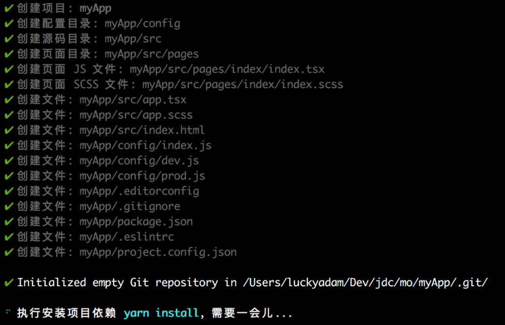

# 2. Taro 的安装及项目初始化

（By: WUYF, 2021.1.5, Modified: YHW, 2021.1.6)

> 上一篇：[1. Taro简介](taro1.md)
>
> 下一篇：[3. 使用React框架开发Taro](taro3.md)

## 1. 安装 Taro CLI 并初始化 Taro 项目

在 cmd / Terminal / PowerShell 中输入命令全局安装 Taro命令行工具（Taro CLI）
```
# TB团队推荐使用 yarn 安装 CLI
$ yarn global add @tarojs/cli
```
在安装完成 Taro命令行工具（Taro CLI）之后，在cmd中输入 `taro init <app_name>` 初始化项目
```
taro init taro

👽 Taro v2.0.7

当前您正在使用 Taro 2.0 版本，请先执行 taro doctor 确保编译配置正确
如出现令你束手无策的问题，请使用 taro update 命令更新到你指定的稳定版本
Taro 即将创建一个新项目!
Need help? Go and open issue: https://github.com/NervJS/taro/issues/new

✔ 拉取远程模板仓库成功！
? 请输入项目介绍！ taro试用
? 请选择框架？ React
? 是否需要使用 TypeScript ？ No
? 请选择 CSS 预处理器（Sass/Less/Stylus） Less
? 请选择模板 redux
.......................................................................

```
> 可能遇到的问题
>
> 如果你的 yarn 或者 npm 没有配置全局变量，当你在 cmd 中输入 taro 的时候
>
> cmd 将会返回 “taro 不是内部或外部命令”
>
> 此时你需要找到 yarn 或 npm 的全局路径，手动配置环境
>
> 详细教程指路 http://taro-club.jd.com/topic/674/taro不是内部或外部命令处理实践

成功创建项目之后


此时，Taro 会默认开始安装项目所需要的依赖，TeaBreak团队推荐使用 yarn进行依赖安装。

>  （一般来说，依赖安装会比较顺利，但某些情况下可能会安装失败。如果无法成功安装项目依赖，可以选择手动打开项目目录进行安装）

```
# 使用 yarn 安装依赖
$ yarn
```
```
# WINDOWS example
C:\Users\86183> cd myapp
C:\Users\86183\myapp> yarn
```


## 2. 将 Taro 程序调试/打包为微信小程序

1. 选择微信小程序模式
2. 然后自行下载并打开微信开发者工具（https://developers.weixin.qq.com/miniprogram/dev/devtools/download.html ），然后选择项目根目录进行预览。
```
# 微信小程序编译预览
$ yarn dev:weapp

# 微信小程序打包
$ yarn build:weapp
```
Dev 模式预计的输出：

```
生成  工具配置  /Users/yanghaowen/-Projects-/TeaBreak/tbapplet/dist/project.config.json

编译  发现入口  src/app.js
编译  发现页面  src/pages/index/index.jsx
✅  编译成功


监听文件修改中...
```

此时你处于“监听文件修改中...”状态，你的修改会实时同步进行打包，并在微信开发者工具中预览到效果


## TB团队推荐的工作方式

微信开发者程序自带了文件列表、Git、文本编辑、Terminal，可 split 的 Console，可以在同一个软件内满足基于 Taro 的小程序开发的，包括编写、运行、查看报错、查看输出、进行效果预览、小程序发布的全部需求，因此建议团队成员使用微信开发者工具进行 Taro 小程序的全部开发工作。


正常的工作状态下，工作屏幕建议如下图所示，在右侧修改代码，在下方 Terminal 查看 Taro 运行状态（或切换至 Console 查看小程序的 Javascript 输出）并在左侧查看最终效果。


---

上一篇：[1. Taro简介](taro1.md)

下一篇：[3. 使用React框架开发Taro](taro3.md)