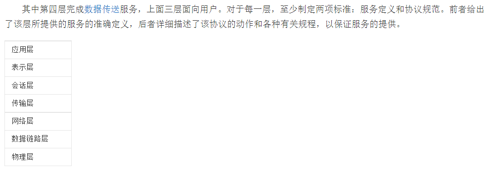
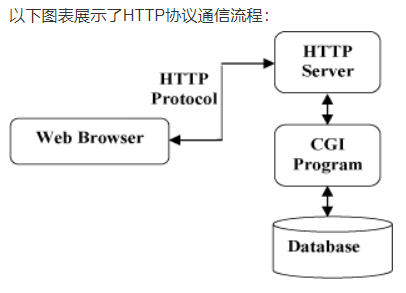
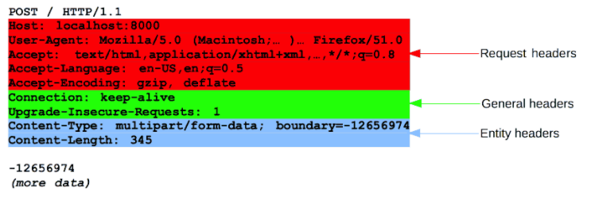
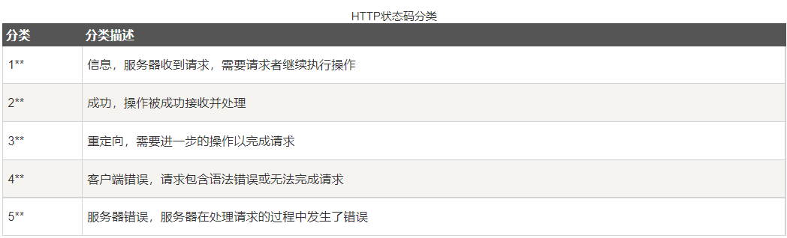
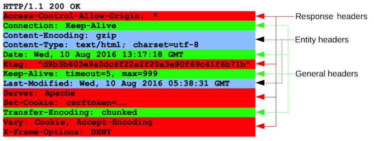

# 1、网络协议

百度百科

网络协议为计算机网络中进行数据交换而建立的规则、标准或约定的集合。

例如，网络中一个微机用户和一个大型主机的操作员进行通信，由于这两个数据终端所用字符集不同，因此操作员所输入的命令彼此不认识。为了能进行通信，`规定每个终端都要将各自字符集中的字符先变换为标准字符集的字符后，才进入网络传送，到达目的终端之后，再变换为该终端字符集的字符。`当然，对于不相容终端，除了需变换字符集字符外还需转换其他特性，如显示格式、行长、行数、屏幕滚动方式等也需作相应的变换。

**TCP/IP**是因特网的正式网络协议，是一组在许多独立主机系统之间提供互联功能的协议，规范因特网上所有计算机互联时的传输、解释、执行、互操作，解决计算机系统的互联、互通、操作性，是被公认的网络通信协议的国际工业标准。TCP/IP是分组交换协议，信息被分成多个分组在网上传输，到达接收方后再把这些分组重新组合成原来的信息

网络协议是由三个要素组成：<br/>
(1) **语义**。语义是解释控制信息每个部分的意义。它规定了需要发出何种控制信息，以及完成的动作与做出什么样的响应。<br/>
(2) **语法**。语法是用户数据与控制信息的结构与格式，以及数据出现的顺序。<br/>
(3) **时序**。时序是对事件发生顺序的详细说明。（也可称为“同步”）。



由于网络节点之间联系的复杂性，在制定协议时，通常把复杂成分分解成一些简单成分，然后再将它们复合起来。最常用的复合技术就是层次方式，网络协议的层次结构如下：<br/>
（1）结构中的每一层都规定有明确的服务及接口标准。<br/>
（2）把用户的应用程序作为最高层<br/>
（3）除了最高层外，中间的每一层都向上一层提供服务，同时又是下一层的用户。<br/>
（4）把物理通信线路作为最低层，它使用从最高层传送来的参数，是提供服务的基础。

# 2、HTTP 协议 （Hyper Text Transfer Protocol）

HTTP是一个基于TCP/IP通信协议来传递数据，用于从万维网（WWW:World Wide Web）服务器传输超文本到本地浏览器的传送协议



## HTTP三点注意事项：

HTTP是无连接：无连接的含义是限制每次连接只处理一个请求。服务器处理完客户的请求，并收到客户的应答后，即断开连接。采用这种方式可以节省传输时间。

HTTP是媒体独立的：这意味着，只要客户端和服务器知道如何处理的数据内容，任何类型的数据都可以通过HTTP发送。客户端以及服务器指定使用适合的MIME-type内容类型。

HTTP是无状态：HTTP协议是无状态协议。无状态是指协议对于事务处理没有记忆能力。缺少状态意味着如果后续处理需要前面的信息，则它必须重传，这样可能导致每次连接传送的数据量增大。另一方面，在服务器不需要先前信息时它的应答就较快。<br/>
[运用http cookie解决这一缺陷](cookie.md)

# 3、HTTP 请求方式

**HTTP是基于客户端/服务端（C/S）的架构模型，通过一个可靠的链接来交换信息，是一个无状态的请求/响应协议。**

HTTP 请求和响应具有相似的结构，由以下部分组成︰<br/>
1. 一行起始行用于描述要执行的请求，或者是对应的状态，成功或失败。这个起始行总是单行的。<br/>
2. 一个可选的HTTP头集合指明请求或描述消息正文。<br/>
3. 一个空行指示所有关于请求的元数据已经发送完毕。<br/>
4. 一个可选的包含请求相关数据的正文 (比如HTML表单内容), 或者响应相关的文档。 正文的大小有起始行的HTTP头来指定。
   
**起始行和  HTTP 消息中的HTTP 头统称为请求头**

# HTTP 请求

## 起始行 (request line)

1. 一个 HTTP 方法，一个动词 (像 GET, PUT 或者 POST) 或者一个名词 (像 HEAD 或者 OPTIONS), 描述要执行的动作. 例如, GET 表示要获取资源，POST 表示向服务器推送数据 (创建或修改资源, 或者产生要返回的临时文件)。
2. 请求目标 (request target)，通常是一个 URL，或者是协议、端口和域名的绝对路径，通常以请求的环境为特征。请求的格式因不同的 HTTP 方法而异。它可以是：
   1. 一个绝对路径，末尾跟上一个 ' ? ' 和查询字符串。这是最常见的形式，称为 原始形式 (origin form)，被 GET，POST，HEAD 和 OPTIONS 方法所使用。
    ```
    POST / HTTP/1.1

    GET /background.png HTTP/1.0

    HEAD /test.html?query=alibaba HTTP/1.1

    OPTIONS /anypage.html HTTP/1.0
    ```
   2. 一个完整的URL，被称为 绝对形式 (absolute form)，主要在使用 GET 方法连接到代理时使用。
    ```
    GET http://developer.mozilla.org/en-US/docs/Web/HTTP/Messages HTTP/1.1
    ```
   3. ？？？？由域名和可选端口（以':'为前缀）组成的 URL 的 authority component，称为 authority form。 仅在使用 CONNECT 建立 HTTP 隧道时才使用。
    ```
    CONNECT developer.mozilla.org:80 HTTP/1.1
    ```
   4. ？？？？星号形式 (asterisk form)，一个简单的星号('*')，配合 OPTIONS 方法使用，代表整个服务器。
    ```
    OPTIONS * HTTP/1.1
    ```
3. HTTP 版本 (HTTP version)，定义了剩余报文的结构，作为对期望的响应版本的指示符。

## Headers

来自请求的 HTTP headers 遵循和 HTTP header 相同的基本结构：不区分大小写的字符串，紧跟着的冒号 (':') 和一个结构取决于 header 的值。 整个 header（包括值）由一行组成，这一行可以相当长。

有许多请求头可用，它们可以分为几组：

1. General headers，例如 Via，适用于整个报文。
2. Request headers，例如 User-Agent，Accept-Type，通过进一步的定义(例如 Accept-Language)，或者给定上下文(例如 Referer)，或者进行有条件的限制 (例如 If-None) 来修改请求。
3. Entity headers，例如 Content-Length，适用于请求的 body。显然，如果请求中没有任何 body，则不会发送这样的头文件。



## [响应头信息详情](https://www.runoob.com/http/http-header-fields.html)

[实例：Chrome 抓包分析](Chrome抓包分析network.md)

## Body （通常是 POST）

可以分为 `Single-resource body` 和 `Multiple-resource body`

前者由单文件构成，由2个header定义：`Content-Length` 和 `Content-Type`

后者包含多个body，每一部分包含不同的信息位，通常与 [HTML Form](https://developer.mozilla.org/en-US/docs/Learn/Forms) 联系

# HTTP 响应

## 状态码

1. 协议版本，通常为 HTTP/1.1。
2. 状态码 (status code)，表明请求是成功或失败。常见的状态码是 200，404，或 302，其中 `200` 一般用于 `POST` 和 `GET` 请求
3. 状态文本 (status text)。一个简短的，纯粹的信息，通过状态码的文本描述，帮助人们理解该 HTTP 消息。

一个典型的状态行看起来像这样：`HTTP/1.1 404 Not Found`



## Headers

