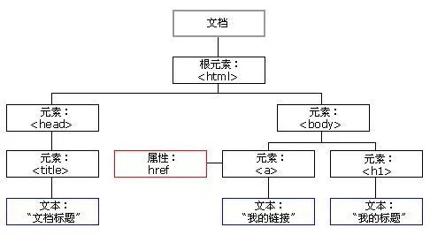

# DOM 元素

参考文章： 
<1> https://developer.mozilla.org/zh-CN/docs/Web/API/Document_Object_Model/Introduction 
<2> https://www.zhihu.com/question/34219998

*浏览器渲染网页的流程
输入的网址在通过DNS解析后得到服务器地址 
浏览器向服务器发起http请求，经过TCP/IP三次握手确认链接后，服务器将需要的代码发回给浏览器。 
浏览器接收到代码后进行解析，经过三大步骤： 
DOM构造、布局以及绘制页面，最终展现为人人都能看懂的网页。*

## 1. 什么是DOM

DOM 全称 Document Object Model，即文档对象模型 
当浏览器接收到一个HTML文档时，会将文档转化为一个文档对象，用这个对象来理页面内容

*DOM的数据结构是**树**，因此DOM又可以称为DOM树*

## 2. 浏览器根据 DOM 进行页面布局 

浏览器按从上到下，从左到右的顺序，读取DOM树的文档节点，顺序存放到一条虚拟的传送带上。 
传送带上的盒子就是节点，而这条流动的传送带就是文档流。 
如果我们读取到的节点是属于另一个节点下的子节点，那么在放入传送带的时候，就应该按顺序放到该节点盒子的内部。 
如果子节点下还有子节点，在传送带上的时候就继续套到子一级的盒子内部。 
根据它在DOM树上的结构，可以嵌套的层级是没有限制的。 
文档流排完之后，开始获取计算节点的坐标和大小等CSS属性，作为盒子的包装说明。 
然后把盒子在仓库里一一摆放，这就将节点布局到了页面。

